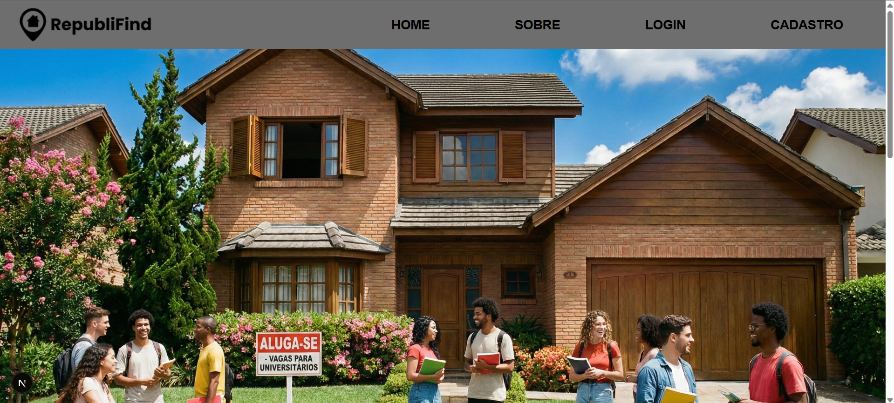
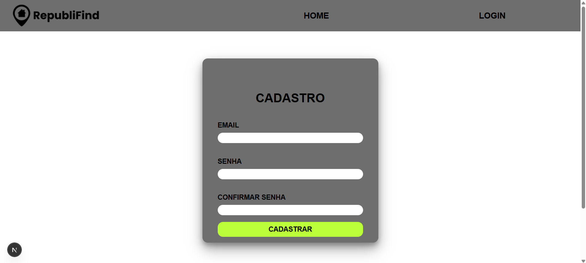
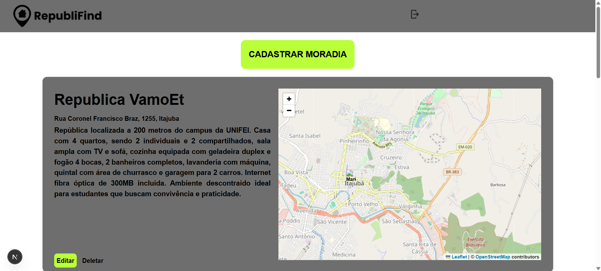

# 🏠 RepubliFind

Plataforma para castro de moradias estudantis

Tecnologias utilizadas:
Frontend: Next.js com React (TypeScript)
Backend: Next.js API Routes
Autenticação: JWT tokens com biblioteca jose
Segurança: Bcrypt para hash de senhas
Validação: Zod para schemas e validação de formulários no client
UI/UX: CSS Modules, React Hot Toast para notificações
Mapas: Leaflet + OpenStreetMap (geocoding via Nominatim)
Persistência: JSON como "banco de dados" (arquivos locais)

Para inicializar o projeto é necessario clonar o repositorio do github e instalar as seguintes dependencias:
npm i
npm i zod
npm i react-hot-toast
npm i bcrypt
npm i jose
npm i leaflet react-leaflet
npm i --save-dev @types/leaflet

É necessario tambem configurar a variavel de ambiente. Crie o arquivo ".env.local" na raiz do projeto, execute o seguinte trecho no terminal:
# Crie o arquivo .env.local na raiz do projeto
# Execute para gerar uma chave segura:
node -e "console.log(require('crypto').randomBytes(64).toString('hex'))"

# Adicione ao .env.local:
JWT_SECRET=sua_chave_gerada_aqui

## 📸 Screenshots
### Landing page

### Tela de cadastro

### Dashboard

integrante: Vitor Rocha Mininel https://github.com/vitorrocha13